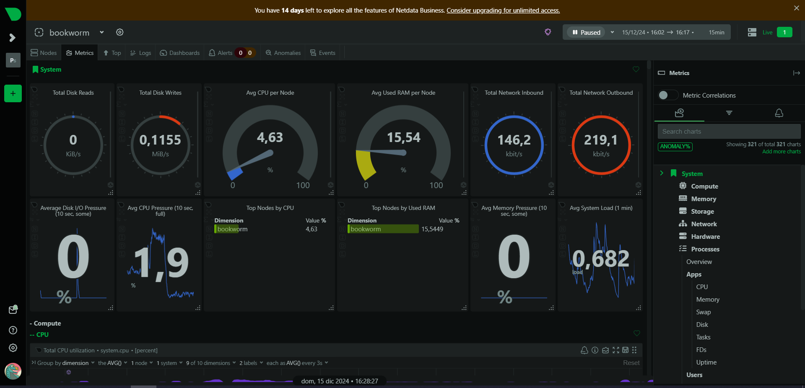
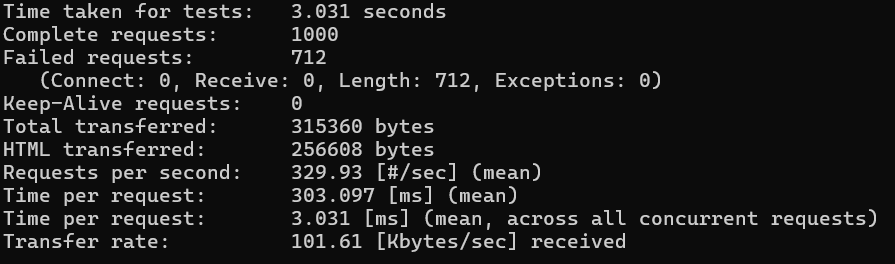
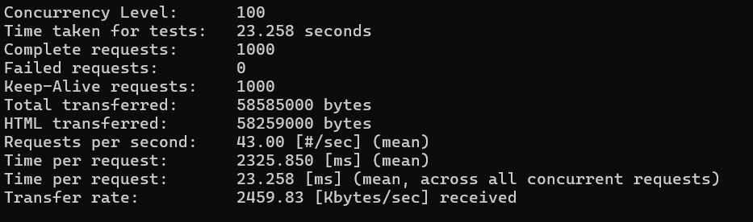
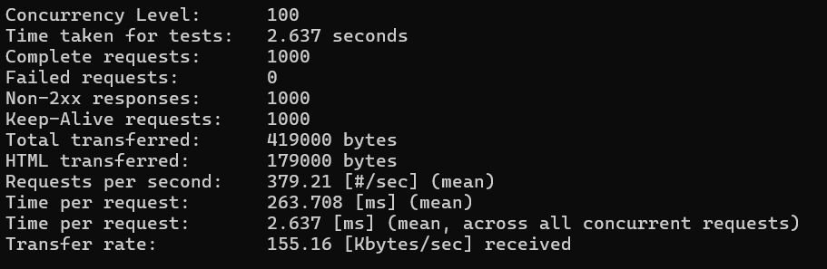
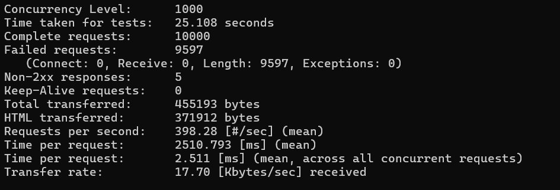
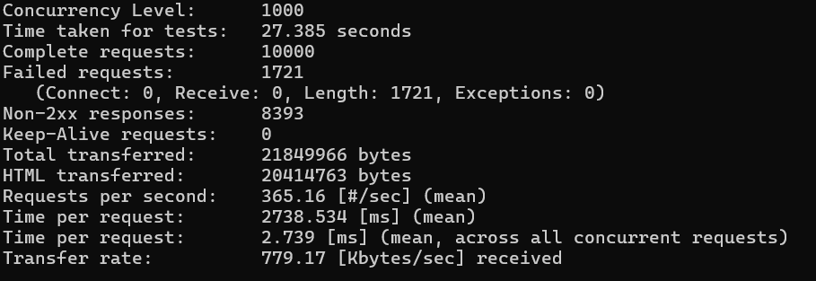
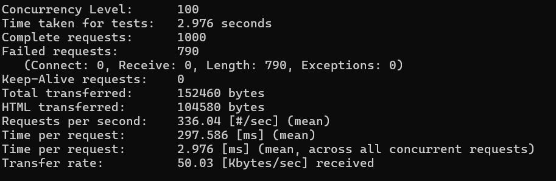
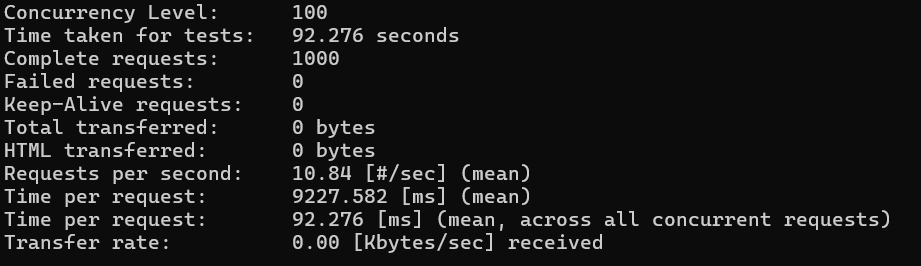
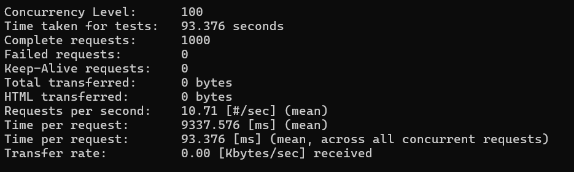

# Project: Server with Ngrok on Virtual Machine

This repository contains a project to set up and host a web server on a virtual machine using Vagrant, Nginx, and Ngrok. It also includes performance tests and specific configurations such as landing pages, custom errors, and password-protected pages.

---

## Requirements

- **Host Operating System**: Windows/Linux/MacOS
- **Required Software**:
  - [VirtualBox](https://www.virtualbox.org/)
  - [Vagrant](https://www.vagrantup.com/)
  - [Ngrok](https://ngrok.com/)
- **VM Minimum Resources**:
  - 2 CPUs
  - 2 GB RAM

---

## Domain Registration with Ngrok

Ngrok was configured to expose the Nginx server via an HTTPS tunnel. The domain generated by Ngrok is:

```
amazingly-proper-cod.ngrok-free.app
```

Ngrok was installed and automatically configured via the `Vagrantfile`, using the corresponding authentication token.

---

## Certificates Used in the Vagrantfile

The Nginx server uses SSL certificates generated with OpenSSL. The certificates are configured for:

- **Domain**: `myserver`
- **Organization**: IZV
- **Email**: `adminr@myserver.com`
- **Location**: Andalucía, Spain

```bash
sudo openssl req -x509 -nodes -days 365 \
    -newkey rsa:2048 -keyout /etc/ssl/private/myserver.key \
    -out /etc/ssl/certs/myserver.crt \
   -subj "/C=ES/ST=Andalucia/L=GRX/O=IZV/OU=DAW/CN=myserver/emailAddress=adminr@myserver.com"
```

---

## Pages Development

### Landing Page

File: `index.html`

Includes a static landing page hosted in `/var/www/myserver/html`. This page serves as the main entry point, allowing access to all server functionalities.

### Custom Error Page

File: `error404.html`

A custom 404 error page was configured to enhance user experience.

### Status and Admin Pages

1. **Admin Page**:

   - Accessible via `admin.html`.
   - Password-protected page where you can see details of the system administrator.
   - **Credentials**:
     - Username: `admin`
     - Password: `asir`

2. **Status Page**:

   - Accessible via `status.html`.
   - Displays server status and metrics.
   - **Credentials**:
     - Username: `sysadmin`
     - Password: `risa`
   - Built using **Netdata** technology for real-time monitoring.
   - Commands used to embed Netdata:

   ```bash
   bash <(curl -sSL https://my-netdata.io/kickstart.sh) --dont-wait
   ```

   - To access advanced metrics:
     1. Register on the [Netdata website](https://www.netdata.cloud/).
     2. Use the command provided by Netdata on the command line to obtain a token.
     3. Log in using the token to unlock detailed monitoring features.



## Nginx Configuration

The Nginx server was configured with the following elements:

- **Server Root**: `/var/www/myserver/html`
- **Basic Authentication** for sensitive pages (admin and status).
- **Self-signed SSL Certificates**.
- **UFW Firewall** configured to allow HTTPS and SSH traffic.

---

## Performance Tests

Performance tests were conducted using standard tools to verify the server's response.
One of the most straightforward and effective tools for conducting web server performance tests is ApacheBench (ab). This tool allows simulating multiple concurrent users and measuring the server's response time under different loads.

For this testing, we will be running performance tests from a machine other than the web server, using two different load configurations:

100 concurrent users with 1000 requests.
1000 concurrent users with 10000 requests.

### Test objectives

The tests will be performed on the following resources:

- **Main Page:** /
- **Static Resource:** /logo.png
- **Admin Page:** /admin/ (with basic authentication)

The following metrics were obtained:

```bash
   ab -n 1000 -c 100 -k https://amazingly-proper-cod.ngrok-free.app/
```



```bash
   ab -n 1000 -c 100 -k https://amazingly-proper-cod.ngrok-free.app/logo.png
```



```bash
   ab -n 1000 -c 100 -k -A sysadmin:risa https://amazingly-proper-cod.ngrok-free.app/admin/
```



```bash
   ab -n 10000 -c 1000 -k https://amazingly-proper-cod.ngrok-free.app/
```



```bash
   ab -n 10000 -c 1000 -k https://amazingly-proper-cod.ngrok-free.app/logo.png
```


```bash
   ab -n 10000 -c 1000 -k -A sysadmin:risa https://amazingly-proper-cod.ngrok-free.app/admin/
```



```bash
   ab -n 1000 -c 100 -k -H "Accept-Encoding: gzip, deflate" https://amazingly-proper-cod.ngrok-free.app/
```



```bash
   ab -n 1000 -c 100 -k -H "Accept-Encoding: gzip, deflate" https://amazingly-proper-cod.ngrok-free.app/logo.png
```



```bash
   ab -n 1000 -c 100 -k -H "Accept-Encoding: gzip, deflate" -A sysadmin:risa https://amazingly-proper-cod.ngrok-free.app/admin/
```



---

## Conclusion

The server handles requests with reasonable response times in most cases. Static resources are delivered without errors, and the basic authentication process works correctly without significantly affecting overall performance.

In the initial test, a high number of failures suggest potential issues with the server’s capacity to handle large loads. Furthermore, the response time increases as more content is required to load, and when more users attempt to access the page simultaneously. Static resources, in particular, experience delays, which could indicate server bottlenecks.

**Potential Causes:**
The slower response times and errors observed may be due to several factors:

- Server Resource Constraints: The server might not have sufficient CPU or memory resources to efficiently handle a high number of concurrent users and large content loads. This can lead to timeouts or failures in resource delivery.
- Network Latency: Increased traffic can lead to network congestion, especially when there are large amounts of data to transfer, resulting in slower load times.
- Inefficient Caching: Static resources may not be adequately cached, causing them to be reloaded with each request, which increases the load on the server and slows response times.
- Basic Authentication Overhead: While basic authentication is functioning properly, it could add overhead to the server as it processes each authentication request, further slowing down performance when multiple users are trying to access protected resources simultaneously.
